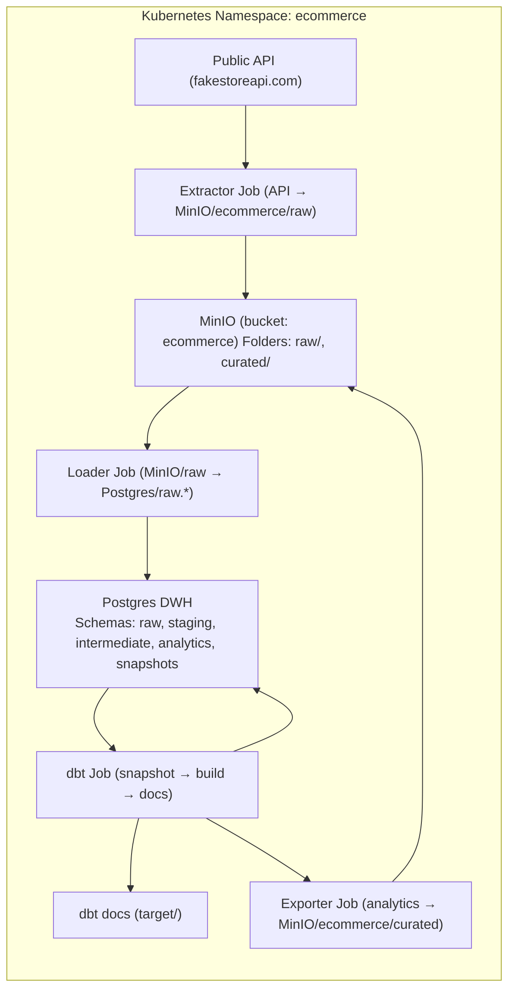
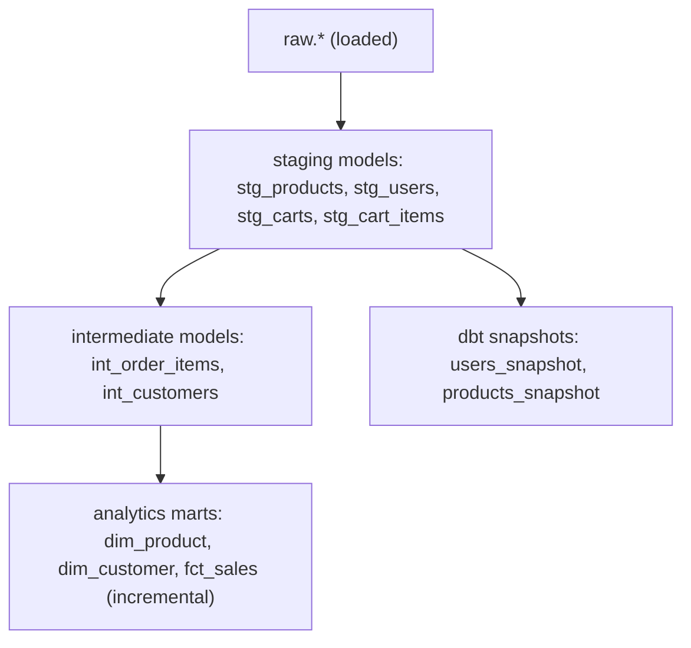

# 🧱 End-to-End Data Pipeline on Kubernetes (MinIO → Postgres → dbt)

This repository implements an end-to-end, containerized data pipeline that:

1. Extracts e-commerce data from a public API (`https://fakestoreapi.com`)
2. Lands raw JSON files into MinIO (S3-compatible object storage)
3. Loads that raw data into Postgres (`raw.*` schema)
4. Transforms it using dbt (staging → intermediate → marts)
5. (Optional) Exports curated tables back to MinIO  
6. (Bonus) Includes Airflow orchestration for local runs

All components run as Kubernetes workloads and are portable across local or cloud clusters.

---

## ⚙️ Architecture







Public API → Extractor(Job) → MinIO (raw/date=YYYY-MM-DD/)
│
▼
Loader(Job) → Postgres (raw.*)
│
▼
dbt(Job): staging → intermediate → marts
│
└── (optional) Exporter(Job) → MinIO (curated/)
yaml

---

## 🗂️ Repository Layout

K8s/ # Kubernetes manifests (MinIO, Postgres, Secrets, Jobs)
extractor/ # Python app: API → MinIO (raw partitioned)
loader/ # Python job: MinIO(raw) → Postgres(raw.* tables)
ecommerce_dbt/ # dbt project (staging/intermediate/marts, tests, snapshots)
dbt-runner/ # Docker image + profiles.yml for dbt
exporter/ # Optional: export curated marts back to MinIO
airflow-local/ # Optional: docker-compose Airflow setup
.github/workflows/ci.yml# GitHub Actions pipeline
scripts/ # Helper scripts (e.g., rerun-all.sh)

yaml


---

## Prerequisites

- Docker 24+
- Kubernetes (e.g. Kind, Minikube, or K3D)
- `kubectl` CLI  
- Optional: `helm` 
- No local Python needed — everything runs in containers

---

## Quickstart (Local Kubernetes)

### 1️⃣ Create a Kind cluster

```bash
kind create cluster --name ecommerce
Build and load Docker images
docker build -t extractor:0.2 ./extractor
docker build -t loader:0.2 ./loader
docker build -t exporter:0.1 ./exporter
docker build -t dbt-runner:0.1 -f dbt-runner/Dockerfile .

kind load docker-image extractor:0.2 --name ecommerce
kind load docker-image loader:0.2 --name ecommerce
kind load docker-image exporter:0.1 --name ecommerce
kind load docker-image dbt-runner:0.1 --name ecommerce

Deployment & Execution


kubectl -n ecommerce apply -f K8s/minio-secret.yaml
kubectl -n ecommerce apply -f K8s/minio-config.yaml
kubectl -n ecommerce apply -f K8s/postgres-secret.yaml

kubectl -n ecommerce apply -f K8s/minio.yaml
kubectl -n ecommerce apply -f K8s/postgres.yaml
kubectl -n ecommerce apply -f K8s/postgres-init.yaml
Run the Data Pipeline (Jobs)
All Jobs use metadata.generateName, so you must use kubectl create (not apply).

Extract — API → MinIO /raw/

kubectl -n ecommerce create -f K8s/extractor-config.yaml
kubectl -n ecommerce create -f K8s/extractor-job.yaml
kubectl -n ecommerce logs -l app=extractor -f --since=1h
Load — MinIO /raw/ → Postgres raw.*

kubectl -n ecommerce create -f loader/loader-job.yaml
kubectl -n ecommerce logs -l app=loader -f --since=1h

Transform (dbt) — staging → intermediate → marts

kubectl -n ecommerce create -f K8s/dbt-job.yaml
kubectl -n ecommerce logs -l app=dbt -f --since=1h
(Optional) Export — curated marts → MinIO /curated/

kubectl -n ecommerce create -f K8s/exporter-job.yaml
kubectl -n ecommerce logs -l app=exporter -f --since=1h
Re-running the pipeline
Each Job creates a fresh run (unique name). To re-run cleanly:

kubectl -n ecommerce delete job -l 'app in (extractor,loader,dbt,exporter)' --ignore-not-found
Then recreate the Jobs using the same commands above.

Tear down everything (optional cleanup)

kubectl -n ecommerce delete all -l app=minio
kubectl -n ecommerce delete all -l app=postgres
kubectl -n ecommerce delete job -l 'app in (extractor,loader,dbt,exporter)' --ignore-not-found
Configuration & Secrets
MinIO
Defined in:

K8s/minio-config.yaml

K8s/minio-secret.yaml

Variable	Description
MINIO_ROOT_USER	Root username
MINIO_ROOT_PASSWORD	Root password
MINIO_BUCKET	Default bucket
RAW_PREFIX	Raw data folder (default: raw/)
CURATED_PREFIX	Curated folder (default: curated/)

Access MinIO console:

bash
Copy code
kubectl -n ecommerce port-forward svc/minio 9000:9000 9001:9001
Visit http://localhost:9001 → login with secret credentials.

Postgres
Defined in:

K8s/postgres-secret.yaml

K8s/postgres.yaml

K8s/postgres-init.yaml

Variable	Description
POSTGRES_DB	Database name (warehouse_db)
POSTGRES_USER	User (warehouse)
POSTGRES_PASSWORD	Password (warehouse_pwd)

Port-forward for DBeaver or psql:


kubectl -n ecommerce port-forward svc/postgres 5432:5432
Connect using:

Host: 127.0.0.1
Port: 5432
Database: warehouse_db
User: warehouse
Password: warehouse_pwd
dbt Project (ecommerce_dbt/)
Model Layers
Layer	Purpose
staging	Raw → typed & cleaned
intermediate	Business join logic
marts	Analytical tables (facts & dims)

Key Models
stg_products, stg_users, stg_carts, stg_cart_items

int_order_items, int_customers

dim_product, dim_customer, fct_sales (incremental)

Snapshots: snapshots/users_snapshot.sql, snapshots/products_snapshot.sql

Run dbt locally (optional)
bash
Copy code
docker run --rm -it -p 8080:8080 \
  -e PG_HOST=localhost -e PG_DB=warehouse_db \
  -e PG_USER=warehouse -e PG_PASSWORD=warehouse_pwd \
  dbt-runner:0.1 bash -lc "cd /work/ecommerce_dbt && dbt docs serve --port 8080 --no-browser"
Open http://localhost:8080 to browse dbt docs.

🧾 Example Queries
sql
Copy code
-- Top 10 products by revenue
SELECT p.title, SUM(s.line_amount) AS revenue
FROM analytics.fct_sales s
JOIN analytics.dim_product p USING (product_id)
GROUP BY 1
ORDER BY revenue DESC
LIMIT 10;

-- Repeat customers
SELECT c.customer_id, c.full_name, COUNT(DISTINCT s.cart_id) AS orders
FROM analytics.dim_customer c
JOIN analytics.fct_sales s ON s.customer_id = c.customer_id
GROUP BY 1,2
HAVING COUNT(DISTINCT s.cart_id) > 1
ORDER BY orders DESC;
🧩 CI/CD Integration
GitHub Actions: .github/workflows/ci.yml (already present)

GitLab required by assignment — add .gitlab-ci.yml:


stages: [build, test, deploy, transform]

build:
  stage: build
  image: docker:24
  services: [docker:24-dind]
  script:
    - docker build -t extractor:$CI_COMMIT_SHORT_SHA ./extractor
    - docker build -t loader:$CI_COMMIT_SHORT_SHA ./loader
    - docker build -t exporter:$CI_COMMIT_SHORT_SHA ./exporter
    - docker build -t dbt-runner:$CI_COMMIT_SHORT_SHA -f dbt-runner/Dockerfile .

test:
  stage: test
  image: dbt-runner:$CI_COMMIT_SHORT_SHA
  script:
    - cd /work/ecommerce_dbt
    - dbt deps
    - dbt build --select state:modified+

deploy:
  stage: deploy
  image: bitnami/kubectl:latest
  script:
    - kubectl apply -f K8s/minio.yaml
    - kubectl apply -f K8s/minio-secret.yaml
    - kubectl apply -f K8s/minio-config.yaml
    - kubectl apply -f K8s/postgres-secret.yaml
    - kubectl apply -f K8s/postgres.yaml
    - kubectl apply -f K8s/postgres-init.yaml

transform:
  stage: transform
  image: bitnami/kubectl:latest
  script:
    - kubectl create -f K8s/extractor-job.yaml
    - kubectl create -f loader/loader-job.yaml
    - kubectl create -f K8s/dbt-job.yaml
    - kubectl create -f K8s/exporter-job.yaml || true
🩺 Observability
readinessProbe and livenessProbe defined for Postgres & MinIO

Logs:

bash

kubectl -n ecommerce logs job/<job-name>
Optional: integrate Prometheus annotations or Grafana dashboards

## 🔁 One-shot Rerun Script

This repo includes a helper script to **re-run the full pipeline end-to-end** with fresh Jobs (because our Job manifests use `metadata.generateName`).

**Script:** `scripts/rerun-all.sh`

**What it does:**
1. Deletes any completed Jobs for `extractor`, `loader`, `dbt`, `exporter`
2. Recreates each Job (using `kubectl create`)
3. Streams logs so you can watch progress

**Usage:**
```bash
# make it executable once
chmod +x scripts/rerun-all.sh

# run it (assumes namespace "ecommerce")
./scripts/rerun-all.sh
Expected output:

New Job names like extractor-job-xxxxx, loader-job-yyyyy, etc.

Logs for each job in order.

Non-zero exit code if any Job fails.

Notes:

The script assumes the namespace is ecommerce and that all infra (MinIO/Postgres/Secrets/ConfigMaps) has already been applied.

If you edit Job YAMLs, the script will delete old Jobs and create new ones so you always get a clean run.

bash
Copy code

If your script doesn’t already do the deletes/creates, here’s the core it should include (you can compare and adjust):

```bash
#!/usr/bin/env bash
set -euo pipefail

NS=${NS:-ecommerce}

echo "Deleting old Jobs…"
kubectl -n "$NS" delete job -l 'app in (extractor,loader,dbt,exporter)' --ignore-not-found

echo "Creating fresh Jobs…"
kubectl -n "$NS" create -f K8s/extractor-config.yaml
kubectl -n "$NS" create -f K8s/extractor-job.yaml
kubectl -n "$NS" create -f loader/loader-job.yaml
kubectl -n "$NS" create -f K8s/dbt-job.yaml
kubectl -n "$NS" create -f K8s/exporter-job.yaml || true

echo "Tailing logs… (Ctrl+C to stop)"
kubectl -n "$NS" logs -l app=extractor -f --since=1h || true
kubectl -n "$NS" logs -l app=loader    -f --since=1h || true
kubectl -n "$NS" logs -l app=dbt       -f --since=1h || true
kubectl -n "$NS" logs -l app=exporter  -f --since=1h || true


✅ Gaps Checklist (what’s optional / to polish)
Area	Status	Notes
GitLab CI	🔧 Required	.gitlab-ci.yml provided above
Architecture diagram	🔧 Optional	Add docs/architecture.png and embed
Airflow orchestration	✅ Included (docker-compose)	Optional for bonus points
Secrets via env	✅ Configured properly	
Health checks	✅ Basic probes present	
dbt tests	✅ Included	
Snapshots	✅ Included	
Incremental models	✅ fct_sales	
Docs generation	✅ via dbt Job	

Cleanup
bash
Copy code
kind delete cluster --name ecommerce
Author: Tripti Bansal
Tech Stack: Kubernetes • Python • MinIO • PostgreSQL • dbt • Docker • Airflow (optional)