Angi Practical 
Project Overview

This project implements a full end-to-end data engineering pipeline using:

Python for extraction, loading, and exporting

dbt for transformations, testing, and snapshots

Postgres as the data warehouseß

MinIO as the data lake (raw + curated zones)

Kubernetes for orchestration

GitHub Actions for CI/CD automation

The pipeline extracts data from the public API fakestoreapi.com
, stages and transforms it with dbt, snapshots historical changes, and exports curated results back to MinIO.

## ⚙️ Architecture


End-to-end pipeline

```mermaid
flowchart TD
    %% Direction: top-down (prevents overlap)
    %% Title
    classDef box fill:#eef1ff,stroke:#5b67b2,stroke-width:1px,color:#111,rx:8,ry:8;

    subgraph NS [Kubernetes Namespace: ecommerce]
        API["Public API (fakestoreapi.com)"]:::box
        EX["Extractor Job (API → MinIO/ecommerce/raw)"]:::box
        MINIO["MinIO (bucket: ecommerce)\nFolders: raw/, curated/"]:::box
        LD["Loader Job (MinIO/raw → Postgres/raw.*)"]:::box
        PG["Postgres DWH (Schemas: raw, staging, intermediate, analytics, snapshots)"]:::box
        DBT["dbt Job (snapshots, build, docs)"]:::box
        EXP["Exporter Job (analytics → MinIO/ecommerce/curated)"]:::box
        DOCS["dbt Docs (target/)"]:::box
    end

    %% Flow connections
    API --> EX --> MINIO --> LD --> PG --> DBT --> DOCS
    DBT --> EXP --> MINIO
```


dbt layers + snapshots


Public API → Extractor(Job) → MinIO (raw/date=YYYY-MM-DD/)
│
▼
Loader(Job) → Postgres (raw.*)
│
▼
dbt(Job): staging → intermediate → marts
│
└── (optional) Exporter(Job) → MinIO (curated/)
yaml

---

## Components 

| Stage         | Tool                       | Description                                             |
| ------------- | -------------------------- | ------------------------------------------------------- |
| **Extract**   | `extractor/`               | Pulls data from FakeStore API → MinIO (`raw/`)          |
| **Load**      | `loader/`                  | Loads JSON data from MinIO/raw → Postgres (`raw.*`)     |
| **Transform** | `dbt-runner`               | Runs dbt models, tests, and snapshots                   |
| **Export**    | `exporter/`                | Writes curated tables (analytics) back to MinIO/curated |
| **Infra**     | `K8s/`                     | Kubernetes manifests for MinIO, Postgres, Jobs, Secrets |
| **CI/CD**     | `.github/workflows/ci.yml` | Builds Docker images on every push                      |

---
## CI/CD (GitHub)

This project uses GitHub Actions instead of GitLab CI/CD.

Current Workflow

.github/workflows/ci.yml → builds all service images:

extractor:ci

loader:ci

exporter:ci

dbt-runner:ci

Manual Execution

Other stages (test, deploy, transform) are executed manually using:

bash scripts/rerun-all.sh


This script runs the entire pipeline on your local kind cluster.

## dbt Project

Folders: staging/, intermediate/, marts/, snapshots/

Snapshots: users_snapshot, products_snapshot

Tests: Built-in dbt schema tests (unique, not_null)

Docs: Generate manually

cd ecommerce_dbt
dbt deps && dbt build && dbt docs generate
dbt docs serve


→ opens http://localhost:8080

## Quickstart (Local Kubernetes)

### 1️⃣ Create a Kind cluster

```bash
kind create cluster --name ecommerce-pipeline
Build and load Docker images
docker build -t extractor:0.2 ./extractor
docker build -t loader:0.2 ./loader
docker build -t exporter:0.1 ./exporter
docker build -t dbt-runner:0.1 -f dbt-runner/Dockerfile .

kind load docker-image extractor:0.2 --name ecommerce-pipeline
kind load docker-image loader:0.2 --name ecommerce-pipeline
kind load docker-image exporter:0.1 --name ecommerce-pipeline
kind load docker-image dbt-runner:0.1 --name ecommerce-pipeline

Deployment & Execution


kubectl -n ecommerce apply -f K8s/minio-secret.yaml
kubectl -n ecommerce apply -f K8s/minio-config.yaml
kubectl -n ecommerce apply -f K8s/postgres-secret.yaml

kubectl -n ecommerce apply -f K8s/minio.yaml
kubectl -n ecommerce apply -f K8s/postgres.yaml
kubectl -n ecommerce apply -f K8s/postgres-init.yaml

Run the Data Pipeline (Jobs)
All Jobs use metadata.generateName, so you must use kubectl create (not apply).

Extract — API → MinIO /raw/

kubectl -n ecommerce apply -f K8s/extractor-config.yaml
kubectl -n ecommerce create -f K8s/extractor-job.yaml
LATEST_EXTRACTOR_JOB=$(kubectl -n ecommerce get jobs -o jsonpath='{range .items[*]}{.metadata.name}{"\n"}{end}' | grep '^extractor-job-' | sort | tail -1)
kubectl -n ecommerce logs -f job/$LATEST_EXTRACTOR_JOB


Load — MinIO /raw/ → Postgres raw.*

kubectl -n ecommerce create -f loader/loader-job.yaml
LATEST_LOADER_JOB=$(kubectl -n ecommerce get jobs -o jsonpath='{range .items[*]}{.metadata.name}{"\n"}{end}' \
| grep '^loader-job-' | sort | tail -1)
kubectl -n ecommerce logs -f job/$LATEST_LOADER_JOB

Transform (dbt) — staging → intermediate → marts

kubectl -n ecommerce create -f K8s/dbt-job.yaml
kubectl -n ecommerce logs -l app=dbt -f --since=1h

(Optional) Export — curated marts → MinIO /curated/

kubectl -n ecommerce create -f K8s/exporter-job.yaml
LATEST_EXPORTER_JOB=$(kubectl -n ecommerce get jobs -o jsonpath='{range .items[*]}{.metadata.name}{"\n"}{end}' \
  | grep '^exporter-job-' | sort | tail -1)
kubectl -n ecommerce logs -f job/$LATEST_EXPORTER_JOB

Configuration & Secrets
MinIO
Defined in:

K8s/minio-config.yaml

K8s/minio-secret.yaml

Variable	Description
MINIO_ROOT_USER	Root username
MINIO_ROOT_PASSWORD	Root password
MINIO_BUCKET	Default bucket
RAW_PREFIX	Raw data folder (default: raw/)
CURATED_PREFIX	Curated folder (default: curated/)

Access MinIO console:

bash
Copy code
kubectl -n ecommerce port-forward svc/minio 9000:9000 9001:9001
Visit http://localhost:9001 → login with secret credentials.

Postgres
Defined in:

K8s/postgres-secret.yaml

K8s/postgres.yaml

K8s/postgres-init.yaml

Variable	Description
POSTGRES_DB	Database name (warehouse_db)
POSTGRES_USER	User (warehouse)
POSTGRES_PASSWORD	Password (warehouse_pwd)

Port-forward for DBeaver or psql:


kubectl -n ecommerce port-forward svc/postgres 5432:5432
Connect using:

Host: 127.0.0.1
Port: 5432
Database: warehouse_db
User: warehouse
Password: warehouse_pwd
dbt Project (ecommerce_dbt/)
Model Layers
Layer	Purpose
staging	Raw → typed & cleaned
intermediate	Business join logic
marts	Analytical tables (facts & dims)

Key Models
stg_products, stg_users, stg_carts, stg_cart_items

int_order_items, int_customers

dim_product, dim_customer, fct_sales (incremental)

Snapshots: snapshots/users_snapshot.sql, snapshots/products_snapshot.sql

Run dbt locally (optional)
bash
Copy code
docker run --rm -it -p 8080:8080 \
  -e PG_HOST=localhost -e PG_DB=warehouse_db \
  -e PG_USER=warehouse -e PG_PASSWORD=warehouse_pwd \
  dbt-runner:0.1 bash -lc "cd /work/ecommerce_dbt && dbt docs serve --port 8080 --no-browser"
Open http://localhost:8080 to browse dbt docs.

🧾 Example Queries
sql
Copy code
-- Top 10 products by revenue
SELECT p.title, SUM(s.line_amount) AS revenue
FROM analytics.fct_sales s
JOIN analytics.dim_product p USING (product_id)
GROUP BY 1
ORDER BY revenue DESC
LIMIT 10;

-- Repeat customers
SELECT c.customer_id, c.full_name, COUNT(DISTINCT s.cart_id) AS orders
FROM analytics.dim_customer c
JOIN analytics.fct_sales s ON s.customer_id = c.customer_id
GROUP BY 1,2
HAVING COUNT(DISTINCT s.cart_id) > 1
ORDER BY orders DESC;

CI/CD Integration
GitHub Actions: .github/workflows/ci.yml 

GitLab 

stages: [build, test, deploy, transform]

build:
  stage: build
  image: docker:24
  services: [docker:24-dind]
  script:
    - docker build -t extractor:$CI_COMMIT_SHORT_SHA ./extractor
    - docker build -t loader:$CI_COMMIT_SHORT_SHA ./loader
    - docker build -t exporter:$CI_COMMIT_SHORT_SHA ./exporter
    - docker build -t dbt-runner:$CI_COMMIT_SHORT_SHA -f dbt-runner/Dockerfile .

test:
  stage: test
  image: dbt-runner:$CI_COMMIT_SHORT_SHA
  script:
    - cd /work/ecommerce_dbt
    - dbt deps
    - dbt build --select state:modified+

deploy:
  stage: deploy
  image: bitnami/kubectl:latest
  script:
    - kubectl apply -f K8s/minio.yaml
    - kubectl apply -f K8s/minio-secret.yaml
    - kubectl apply -f K8s/minio-config.yaml
    - kubectl apply -f K8s/postgres-secret.yaml
    - kubectl apply -f K8s/postgres.yaml
    - kubectl apply -f K8s/postgres-init.yaml

transform:
  stage: transform
  image: bitnami/kubectl:latest
  script:
    - kubectl create -f K8s/extractor-job.yaml
    - kubectl create -f loader/loader-job.yaml
    - kubectl create -f K8s/dbt-job.yaml
    - kubectl create -f K8s/exporter-job.yaml || true
🩺 Observability
readinessProbe and livenessProbe defined for Postgres & MinIO

Logs:

bash

kubectl -n ecommerce logs job/<job-name>

## One-shot Rerun Script

This repo includes a helper script to re-run the full pipeline end-to-end with fresh Jobs (because our Job manifests use `metadata.generateName`).

Script: `scripts/rerun-all.sh`

What it does:
1. Deletes any completed Jobs for `extractor`, `loader`, `dbt`, `exporter`
2. Recreates each Job (using `kubectl create`)
3. Streams logs so you can watch progress

Usage:
```bash
# make it executable once
chmod +x scripts/rerun-all.sh

# run it (assumes namespace "ecommerce")
./scripts/rerun-all.sh
```
Expected output:

New Job names like extractor-job-xxxxx, loader-job-yyyyy, etc.

Logs for each job in order.

Non-zero exit code if any Job fails.

Notes:

The script assumes the namespace is ecommerce and that all infra (MinIO/Postgres/Secrets/ConfigMaps) has already been applied.

Cleanup
bash
Copy code
kind delete cluster --name ecommerce-pipeline
Author: Tripti Bansal
Tech Stack: Kubernetes • Python • MinIO • PostgreSQL • dbt • Docker 
Implements required stages: Extract → Load → Transform → Export.